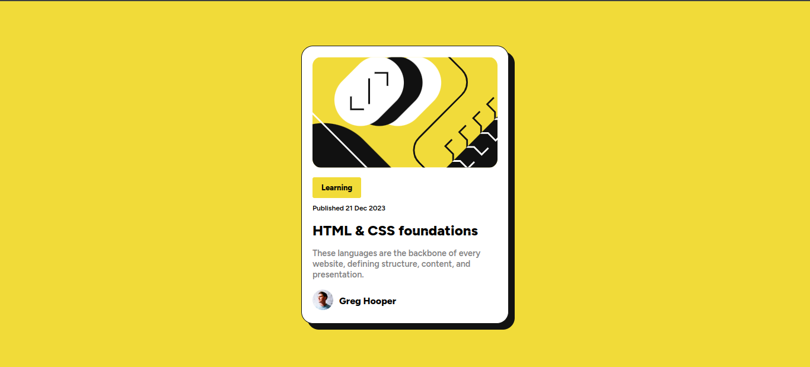

# Blog Preview Card 



# Tecnologias

<ul>
    <li>React JS</li>
    <li>Pré-processador Sass</li>
</ul>

# Como executar

Clone o projeto em seu dispositivo e acesse a pasta do mesmo.

```
$ git clone 
$ cd 
$ code .  (Abrir o Visual Studio Code)
```

Logo em seguida, o projeto estará em seu editor para ser executado.

# Projeto

Blog Preview Card é um desafio da plataforma FrontendMentor, que tem o objetivo de treinar os conceitos Frontend. E para que essa página fosse desenvolvida, foi utilizado ReactJS juntamente com o Sass(Pré-processador CSS).

# Link do projeto hospedado

# Autor

Lara Fernanda

Email: lamorimalvescavalcante@gmail.com

# Licença

Este projeto está sob a licença MIT